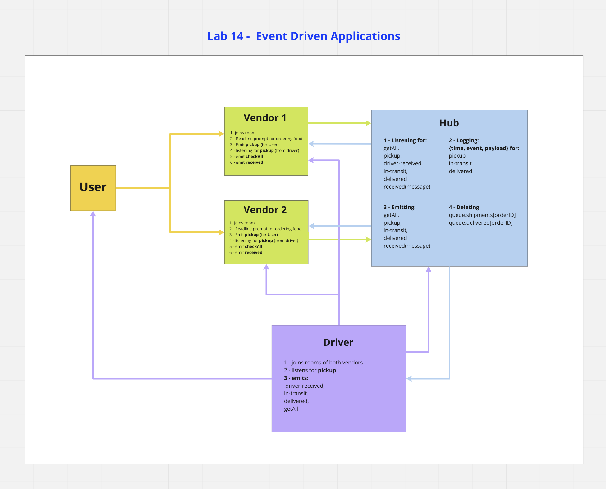

# 401-dasher food delivery service

## Description

Welcome to 401-dashers! We made an application based on a food delivery service! We will send our order and have that ordered tracked when it has been picked up, and when the food item was delivered!

## Authors

- Ayrat Gimranov, Software Engineer
- Charlie Fadness, Software Developer
- Jeremy Brazell, Software Developer

## To Start

Welcome again to 401-dashers! To start our project, first you need to run hub. It is our brain at the momment, run `node hub-server.js`. Second we want to start up dasher, run `node dasher.js`.

From there, we can start adding our food while under the vender.js, type out `node vendor.js <food-item-here>`, this will send a notification to our dashers that will respond, and pick up those food items to deliver! Once you get a notification that your food item is delivered, your done!

## Deployed Link

Heroku Link

- [Hub]()
- [Vendor]()
- [Dasher]()

## Data Modeling

### UML and WRRC

  

## Technology Used

`"socket.io": "^4.3.2"`
`"socket.io-client": "^4.3.2"`
`"express": "^4.17.1"`
`"dotenv": "^10.0.0"`
`"cors": "^2.8.5"`

## Testing

To see our tests, you will have to be under the root folder of dashers, then type in the terminal `npm run test dasher.test.js`, this will run our tests and have them displayed to you!

## Install

```
npm i
```

## Other
