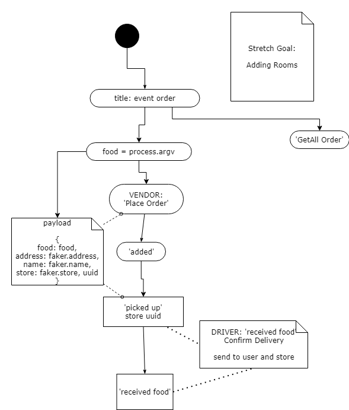

# 401-dasher food delivery service


## Description

Welcome to 401-dashers!

## Authors

- Ayrat Gimranov, Software Engineer
- Charlie Fadness, Software Developer
- Jeremy Brazell, Software Developer

## Deployed Link


## Data Modeling

### UML and WRRC

  

### White Board

<!--  -->

<!-- ## Auth

Auth is hashing out password along with our username that creates a hashed password and username. -->

## Technology Used

`"socket.io": "^4.3.2"`
`"socket.io-client": "^4.3.2"`
`"express": "^4.17.1"`
`"dotenv": "^10.0.0"`
`"cors": "^2.8.5"`

<!-- ## CRUD

POST route for `/register`

```
Accepts JSON or FORM Data with the keys "username" and "password"
Uses postgres to create your new record
Returns a 201 for your created user record
```

POST route for `/signin`

```
Using middleware, we authicate your information with encoding to log in
When validated, sends JSON user record
```

GET route for `/users`

```
Using middleware, we authicate your encryption to display the users that have registered
```

POST route for `/secret`

```
Using middleware, we authicate your information to view specialized secret documents
``` -->

<!-- ## RESTful API

- `/joke` is REST with middleware auth
  - Here we have roles set, the level of role will depend on how many things you can complete with a RESTful API.

Get route for `/get` `/joke`

```
Using REST we grab all our data, if you add "/joke/#", you can view a specific entry 
```

Post route for `/post` `/joke`

```
Using REST we can post data into our server. Models using "name", "filling", and "frosting"
```

Update route for `/put` `/joke/#`

```
Using REST we can update data into our server depending on the specific entry. Models using "name", "filling", and "frosting" to update the entry
```

Delete route for `/delete` `/joke/#`

```
Using REST we can delete data into our server depending on the specific entry.
``` -->

## Routes


## Testing


## Install

```
npm i
```

## Usage

```
node
```

## Other
